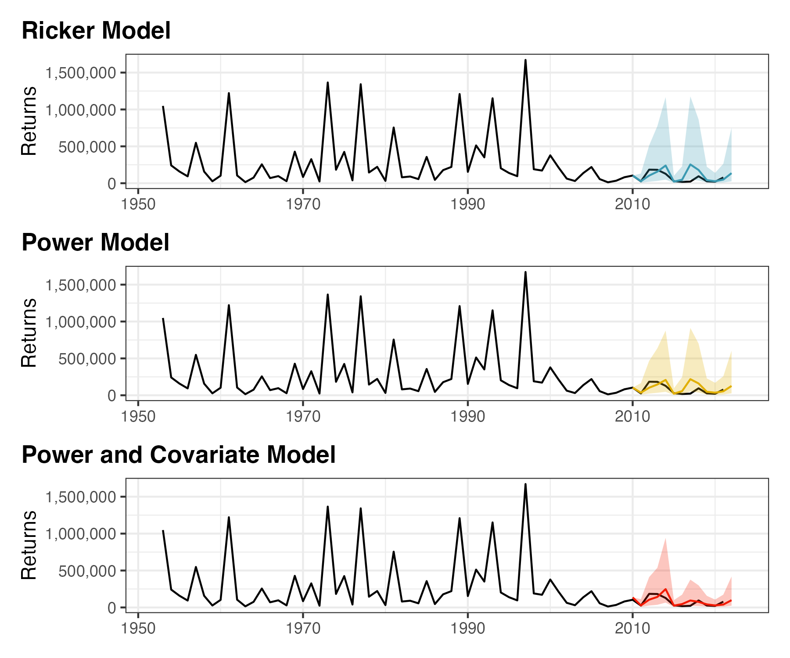
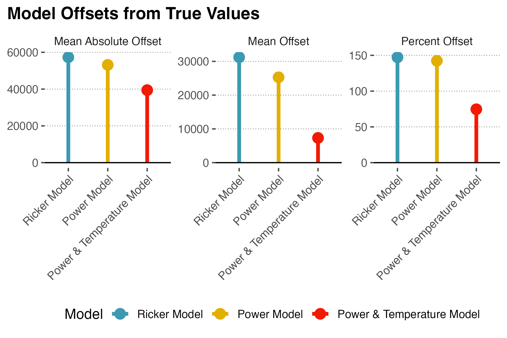
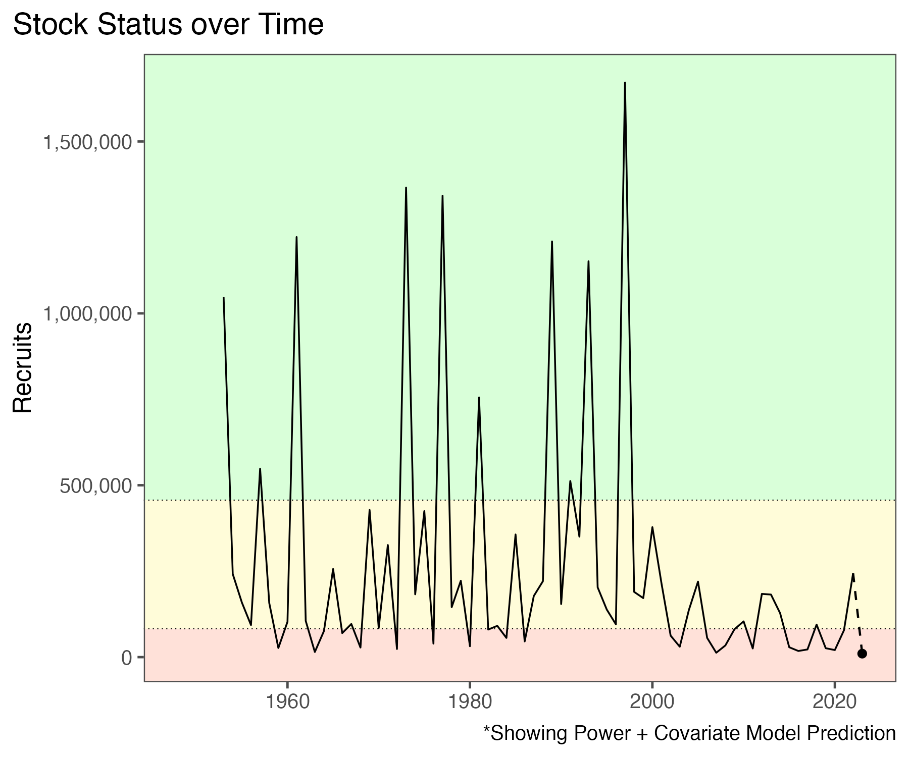

## Case Study: Forecasting fish harvests 
Purpose: compute and compare three different forecasting models (Basic-Ricker, Power, Power with an environmental covariate) to predict the number of Salmon recruiters in the Early Stewart population in 2023. 

Team: Jake Lawlor, Yiran Wang, Emmerson Wilson, and Garland Xie

## Layman summary

Canadians rely on healthy Salmon fish populations to ensure food security, income, healthy ecosystems, and cultural and spiritual use. A common thread across these benefits is appropriate levels of fish harvest. However, decisions on fish harvests are challenging because of the delicate balance between current needs and healthy populations in the future. To address this issue, we must predict the number of Salmons that return back to the rivers they were born in to reproduce across different environments. This allows us to guess how large the future generations of salmon will be, and the number of salmon humans can harvest. Using the Early Stewart River as a case study, we predicted historically small populations in 2023. There was a large landslide that blocked the return of salmon to this river, which is the likely cause for the small population size. Climage change also matters. When leaving this river when they are young, warmer sea surface temperatures lead to low food quality, and this led to even lower fish populations. Here, we recommend limiting fishing to the extent possible. This will hopefully allow the population to recover so that, in the future, we can maintain a healthy population of salmon providing many economic and cultural benefits for Canadians.

## Methods

All materials for fisheries case study on forecasting Fraser Sockeye Salmon returns.

Data includes spawner-recruit data for all Fraser Sockeye stocks with available data, that rear in freshwater for for two winters (Harrison stock removed).

Potential environmental covariates are also included, which are generally assumed to affect early-marine survival, so are synced with each brood-years outmigration year and approximate timing.

All provided code can be found in [Function_new.R](Function_new.R) and [run_forecasts_and_make_plots.R](run_forecasts_and_make_plots.R)

### Model 1: Basic Ricker 

The Ricker model is a discrete stock-recruitment model that incorporates population growth ($\alpha$) and carrying capacity ($\beta$) for Pacific Salmon. Of all the available stocks, Early Stewart population was randomly chosen since it is one of many that is sensitive to environmental changes (see below models). It assumes the chosen population experiences density dependence.

Consider the following model:

$$
R_i = \alpha S_i e^{-\beta S_i} 
$$

We can linearize to obtain simpler parameters:

$$
ln(R_i) = ln(\alpha)+ ln(S_i)-S_i/S_{max}
$$

We place priors on the following:

$$
\widehat{lnR_i} \sim normal(ln(R_i), \tau)
$$

$$
ln(\alpha) \sim normal(\mu_{\alpha}, \tau{\alpha}) 
$$

$$
ln(S\_{max}) \sim normal(\mu_{Smax}, \tau_{Smax})
$$

$$
\tau \sim gamma(\theta, \theta)
$$

### Model 2: Power Model

This alternate model is basically shows that log(recruiters) depends on log(spawners). This is also known as a simple power model which does not assume density dependence.

$$
R_i = A S_i^B
$$

We can linearize equation 10 to the following: 

$$
ln(R_i) = A+B*ln(S_i)
$$

This model form has normal priors for both $A$ and $B$:

$$
A \sim normal(\mu_{A}, \tau_{A}) 
$$

$$
B \sim normal(\mu_{B}, \tau_{B})
$$

And the same gamma prior on precision as the above models (equation 6).

### Model 3: Power model with an environmental covariate

This alternate model is an extension to the previous power model that includes the average sea surface temperatures as an environmental covariate. 
Brooke Davis suggested to take the average of April ($apesst$), May ($maesst$), and June ($jnesst$) sea surface temperatures. This average ($Esst$) is commonly employed by fisheries scientists.

$$
R_i = A S_i^{B+gEsst_{i}}
$$

We can linearize this as the following: 

$$
ln(R_i) = A+B*ln(S_i)+gEsst_{i}
$$

We used the same priors for $A$, $B$, and $g$ as previous above models.

## Deliverables

### Model comparisons

**Figure 1**. The number of Fraser Salmon recruits from 1950 - 2020 in the Early Stewart river. Black lines represent observed recruits. Red lines represent predicted values while shadows are 95% credible intervals from three different forecasting models. The three candidate models are: (1) blue - Basic-Ricker, a discrete stock-recruitment model that incorporates population density-dependence and carrying capacity, (2) yellow - Power, a simple power model that does not account for density dependence, and (3) red - Power + Temperature, an extension of the Power model with average sea surface temperature as an additive environmental covariate.

 

**Figure 2**. Model performances across the three forecasting models (blue - Basic-Ricker, yellow - Power, red - Power + Temperature). Three different performance metrics were used: (1) mean absolute offset, (2) mean offset, and (3) percent offset. 

 

### Final Forecast

**Figure 3**. Stock status (number of recruits) over time in the Early Stewart river population (1950-2023). Black solid lines represent observed number of recruits. Black dashed lines represent the predicted number of recruits in 2023 from the candidate forecasting model (Power + Temperature). 

